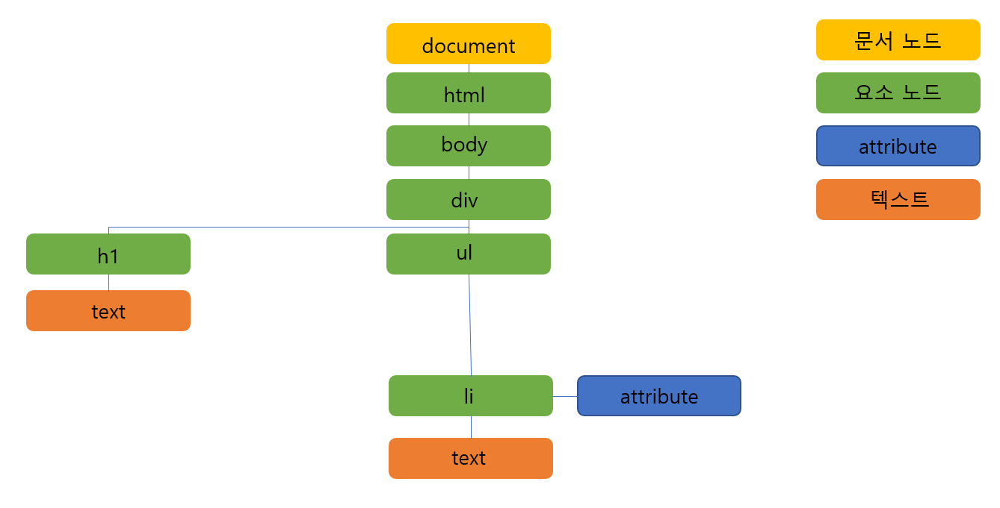

## React 소개

- React는 페이스북에서 사용자 UI 구축을 위해 만든 라이브러리입니다.
- 리액트에 관한 자세한 정리 https://ko.reactjs.org/docs/getting-started.html

## 리액트의 특징

1. JSX 문법
    - JSX는 자바스크립트 안에서 HTML 문법을 사용해서 View 를 구성할 수 있게 도와주는 문법입니다.
        
        - 예제 코드

        ```javascript
            // JSX문법을 사용하지 않는다면 이렇게 사용해야 하는 부분을
            const About = () => {
                return React.createElement(
                    'div',
                    'h2',
                    'About'
                )
            };
        ```

        ```javascript
            // 이렇게 사용할 수 있습니다.
            const About = () => {
                return (
                    <div>
                        <h2>About</h2>
                    </div>
                );
            };

        ```
2. 컴포넌트 기반입니다.

    - 리액트는 컴포넌트 기반 라이브러리 입니다.
        - 컴포넌트 기반으로 코드를 작성하기 때문에 여러부분을 분할해서 코드의 재사용성과 유지 보수성을 증가시켜 줍니다.
        - 컴포넌트 기반이기 때문에 
        예를 들어 코드의 일부분만 수정 해야 한다고 했을때
        수정해야 할 코드를 찾기에도 쉽고 다른 부분에서 문제를 발생시킬 염려가 없습니다.
        (그 부분의 코드만 수정 하면 됩니다.) 

3. 가상돔을 사용합니다.

    - 가상 돔은 기존 DOM의 한계를 탈피하기 위해 나온 대안입니다.
        - DOM이란 ? Document Object Model (단어 그대로 문서 객체 모델입니다.)

        - DOM 예제

        

        - 위 그림 처럼 기존의  DOM 구조는 트리 구조로 되어있습니다.
            
            - 트리구조로 이루어져 있기 때문에 DOM의 요소 하나를 수정하는 함수를 만들고 실행한다면
            렌더 트리를 재생성 하고 다시 레이 아웃을 만들게 됩니다.
            
            - SPA개발을 하면서 DOM요소를 많이 수정한다면 불필요한 연산이 매번 일어나게 되는 문제가 있습니다.
        
        - 그문제를 해결하기 위해 등장한 것이 가상돔입니다.

            - 가상돔은 변화를 가상돔에서 미리 인지해 변화시킵니다.
            그리고 실제 DOM이 아니기 때문에 렌더링도 되지 않고 연산비용이 실제 DOM보다는 적게 사용됩니다.
            변화된 가상 DOM을 마지막에 실제 DOM에 던져주어 한번에 렌더링 되게 합니다.

## 리액트의 생명 주기

- 16.3 이전 버전

    ```javascript

        class Content extends React.Component {
        
        // 생성자 메소드로 컴포넌트가 생성될 때 단 한번만 실행 된다.
        // 이 메소드에서만 state를 설정할 수 있다.
        constructor(props) {
            super(props);
            this.state = {
         
            }
        }

        // React엘리먼트를 실제 DOM 노드에 추가 하기 직전에 호출되는 메소드다.
        // DOM이 생성 되지 않았으므로 DOM을 조작할 수 없고, render 가 호출 되기 전이기 때문에 setState를 사용해도 render가 호출 하지 않는다.
        componentWillMount() {
            console.log('Component WILL MOUNT!')
        }

        // 컴포넌트가 만들어지고 render가 호출된 이후에 호출되는 메소드다.
        // ajax나 타이머를 생성하는 코드를 작성하는 부분이다.
        componentDidMount() {
            console.log('Component DID MOUNT!')
        }

        // 컴포넌트 생성후에 첫 렌더링을 마친 후 호출되는 메서드다.
        // 컴포넌트가 처음 마운트 되는 시점에서는 호출되지 않는다.
        // props를 받아서 state를 변경해야 하는 경우 유용하다.
        // 이메소드 내부에서 setState를 사용해도 추가적인 렌더링이 발생하지 않는다.

        componentWillReceiveProps(nextProps) {    
            console.log('Component WILL RECIEVE PROPS!')
        }

        // 컴포넌트 업데이트 직전에 호출되는 메소드다.
        // props 또는 state가 변경되었을 때, 재 랜더링 여부를 return 값으로 결정한다.
        shouldComponentUpdate(nextProps, nextState) {
            return true;
        }

        // shouldComponentUpdate가 불린 이후에 컴포넌트 업데이트 직전에서 호출되는 메소드다.
        // 새로운 props 또는 state가 반영되기 직전 새로운 값들을 받는다.
        // 이 메서드 안에서 this.setState()를 사용하면 무한 루프가 일어나게 되므로 사용하면 안된다.
        componentWillUpdate(nextProps, nextState) {
            console.log('Component WILL UPDATE!');
        }

        // 컴포넌트 업데이트 직후에 호출되는 메소드다.
        componentDidUpdate(prevProps, prevState) {
            console.log('Component DID UPDATE!')
        }

        // 컴포넌트가 소멸된 시점에 (DOM에서 삭제된 후) 실행되는 메소드다.
        // 컴포넌트 내부에서 타이머나 비동기 API를 사용하고 있을때, 이를 제거하기에 유용하다.
        componentWillUnmount() {
            console.log('Component WILL UNMOUNT!')
        }

        // 컴포넌트 렌더링을 담당 한다.
        render() {
            return (
                <div>
                    <h1>{this.props.sentDigit}</h1>
                </div>
            );
        }
    }

    ```

- 16.3 이후 버전

    - 변경이유

    1.초기 렌더링을 제어하는 방법이 많아져서 혼란이 됨.
    2.오류 처리 인터럽트 동작시에 메모리 누수 발생할 수 있음.
    3.React 커뮤니티에서도 가장 혼란을 야기하는 라이프 사이클

    -componentWillMount, componentWillReceiveProps, componentWillUpdate를 v17 부터 사용불가
    -componentWillReceiveProps 대체 메서드 추가 getDerivedStateFromProps
    -componentWillUpdate 대체 메서드 추가 getSnapshotBeforeUpdate
    -componentDidCatch 컴포넌트 에러 핸들링 API 추가

    ```javascript

        class Content extends React.Component {
        
        // 생성자 메소드로 컴포넌트가 생성될 때 단 한번만 실행 된다.
        // 이 메소드에서만 state를 설정할 수 있다.
        constructor(props) {
            super(props);
            this.state = {
                this.state = { hasError: false };
            }
        }

        // 컴포넌트가 만들어지고 render가 호출된 이후에 호출되는 메소드다.
        // ajax나 타이머를 생성하는 코드를 작성하는 부분이다.
        componentDidMount() {
            console.log('Component DID MOUNT!')
        }

        // Start
        // getDerivedStateFromProps는 componentWillReceiveProps의 대체 역할로 작성된
        // 메서드로 컴포넌트가 인스턴스화 된 후, 새 props를 받앗을 때 호출된다. 주의할 점으로
        // setState를 사용하는 것이 아닌 값을 return 해야한다. state를 갱신하는 객체를 반환할 수 있고, 
        // 새로운 props가 state 갱신을 필요로 하지않음을 나타내기 위해 null을 반환할 수 도 있다.

        // 이전코드 (사용불가)
        componentWillReceiveProps(nextProps) {    
            if (this.props.name !== nextProps.name) {
                this.setState({ name: nextProps.name });
            }
        }

        // 개선된 코드
        static getDerivedStateFromProps(nextProps, prevState) {
            if (prevState.name !== nextProps.name) {
                return { name: nextProps.name };
            }

            return null;
        }

        // END 

        // 컴포넌트 업데이트 직전에 호출되는 메소드다.
        // props 또는 state가 변경되었을 때, 재 랜더링 여부를 return 값으로 결정한다.
        shouldComponentUpdate(nextProps, nextState) {
            return true;
        }

        // Start
        // getSnapshotBeforeUpdate은 componentWillUpdate의 대체 역할로 작성된 메서드로 DOM이 업데이트 직전에 호출된다. 
        // (이 라이프 사이클은 많이 필요하지 않지만, 렌더링되는 동안 수동으로 스크롤 위치를 유지해야할 때와 같은 경우에는 유용할 수 있다)

        // 이전 코드 (사용불가)
        componentWillUpdate(nextProps, nextState) {
            if (this.props.list.length < nextProps.list.length) {
                this.previousScrollOffset =
                this.listRef.scrollHeight - this.listRef.scrollTop;
            }
        }

        // 개선된 코드
        getSnapshotBeforeUpdate(prevProps, prevState) {
            if (prevProps.list.length < this.props.list.length) {
                return (
                this.listRef.scrollHeight - this.listRef.scrollTop
                );
            }
            return null;
        }
        // END

        // 컴포넌트 업데이트 직후에 호출되는 메소드다.
        componentDidUpdate(prevProps, prevState) {
            console.log('Component DID UPDATE!')
        }

        // 컴포넌트가 소멸된 시점에 (DOM에서 삭제된 후) 실행되는 메소드다.
        // 컴포넌트 내부에서 타이머나 비동기 API를 사용하고 있을때, 이를 제거하기에 유용하다.
        componentWillUnmount() {
            console.log('Component WILL UNMOUNT!')
        }

        // 컴포넌트 오류 처리 개선을 위해 추가 되었다.
        // 에러 발생시에 state를 변경하고 render 에서 해당 처리를 구현하면 된다.
        // 주의 할점은 자식 컴포넌트에서 발생하는 에러만 잡아낼 수 있고, 자신의 에러는 잡아낼수 없다.
        componentDidCatch(error, info) {
            // Display fallback UI
            this.setState({ hasError: true });
            // You can also log the error to an error reporting service
            logErrorToMyService(error, info);
        }

        // 컴포넌트 렌더링을 담당 한다.
        render() {
            
            if (this.state.hasError) {
                // You can render any custom fallback UI
                return <h1>Something went wrong.</h1>;
            }

            return (
                <div>
                    <h1>{this.props.children}</h1>
                </div>
            );
        }
    }

    ```

## 시작하기

- Node.Js 설치

    - Node.js 다운로드 링크 https://nodejs.org/ko/
    - 저는 12.16.0LTS 버전으로 설치 하였습니다.


- 프로젝트 생성

    - SPA 프로젝트 생성 (사용 boilerplate : create-react-app )
    - create-react-app의 특징 및 소개

        1. index.html, index.js를 포함한 기본 디렉토리 구성
        1. react, react-dom, react-scripts 및 dependency 라이브러리 설치
        1. react-scripts를 사용하여 package.json에 npm command 정의
        1. Create React App의 자세한 정리 https://github.com/facebook/create-react-app#create-react-app-

    - create-react-app 글로벌 설치 (npm install -g create-react-app)
    - 앱 생성 (create-react-app react-todo)

```javascript
    
    // 프로젝트 생성

    npm install -g create-react-app

    create-react-app react-todo

```

```javascript

    // 프로젝트 실행 (기본 포트 : 3000)

    cd react-todo

    npm start

```