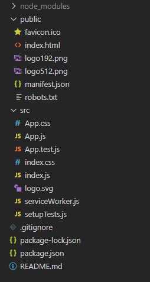
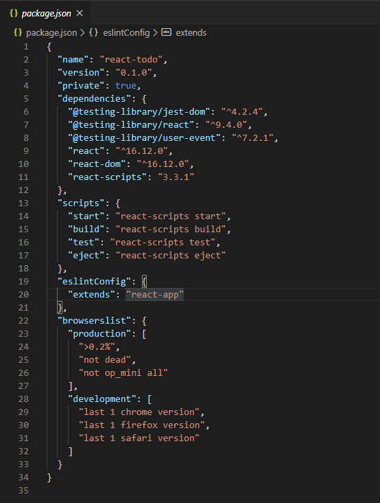
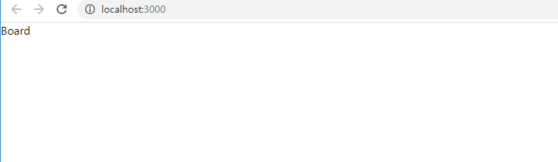

## 프로젝트 구성

- 기본 디렉토리 구성



- package.json 살펴보기



    - package.json을 살펴보면 dependency가 이상하게 적게 보이는데.
    scripts 설정중에 eject라는 명령어를 통해 node_modules/ 폴더에 있는 내부 dependency를 사용할 수 있습니다.


- 기존 소스 코드 분석

```javascript
    
    // src/index.js

    import React from 'react';
    import ReactDOM from 'react-dom';
    import './index.css';
    import App from './App';
    import * as serviceWorker from './serviceWorker';

    ReactDOM.render(<App />, document.getElementById('root'));

    serviceWorker.unregister();

```


  - jsx문법을 사용하기 위한 React 모듈 import
    
    ```javascript

        import React from 'react';

    ```

  - react-dom 모듈은 react앱을 최초 렌더링 하기 위해 사용 됩니다.
    
    ```javascript

        import ReactDOM from 'react-dom';
        
    ```

  - 기본적으로 만들어진 App 이라는 react컴포넌트를 가져오는 코드입니다.

    ```javascript

        import App from './App';
        
    ```

  - serviceWorker : 네트워크가 느리거나 오프라인 상태에서도 온라인 인것 처럼 리소스들을 캐싱해서 보여주는 모듈입니다.

    ```javascript

        import * as serviceWorker from './serviceWorker';

        // root라는 id를 가진 태그를 찾아서 그안에 App 컴포넌트를 랜더링 시키고
        // 이곳이 react웹 엔트리 포인트입니다.
        // 기본 html을 살펴보면 root라는 id를 가진 div태그를 확인 할 수 있습니다. ( public/index.html )
        ReactDOM.render(<App />, document.getElementById('root'));

        serviceWorker.unregister();
        
    ```

  - 위에 랜더링 되고 있는 App.js 파일을 살펴보면

    ```javascript

        import React from 'react';
        import logo from './logo.svg';
        import './App.css';

        function App() {
          return (
            // jsx문법으로 작성된 코드를 렌더링 하고 있는걸 확인할 수 있습니다.
            <div className="App">
              <header className="App-header">
                
                <p>
                  Edit <code>src/App.js</code> and save to reload.
                </p>
                <a
                  className="App-link"
                  href="https://reactjs.org"
                  target="_blank"
                  rel="noopener noreferrer"
                >
                  Learn React
                </a>
              </header>
            </div>
          );
        }

        export default App;
    ```
    - React에서 컴포넌트 생성 호출

      1.src/components/Board/Board.js 생성

      ```javascript

      import React from 'react';

      function Board (){

          return(
              <div>
                  Board
              </div>
          );

      }

      export default Board;

      ```

      2.src/App.js 수정

      ```javascript

      import React, {Component} from 'react';
      import './App.css';
      import Board from './components/Board/Board';

      class App extends Component {


        render() {
          return (
            <div>
              <Board/>
            </div>
          );
        }
      }

      export default App;


      ```

      3.테스트 https://localhost:3000

      


    - React에서의 Css사용

      - 직접 주입하는 방법

      ```javascript

        import React from 'react';

        function Board (){

            // background-color -> backgroundColor 카멜로 표기
            const style ={
                backgroundColor : 'red'
            }

            return(
                <div style={style}>
                    Board
                </div>
            );
        }

        export default Board;

      ```

      - css import방법

      1. css 파일 작성

      ```css

      .HeaderCss{
          background-color: aquamarine;
      }

      ```
      2. css적용 컴포넌트

      ```javascript

        import React from 'react';
        import './Header.css';

        function Header (){
            return(
                <div className='HeaderCss'>
                    Header
                </div>
            );
        }

        export default Header;

      ```