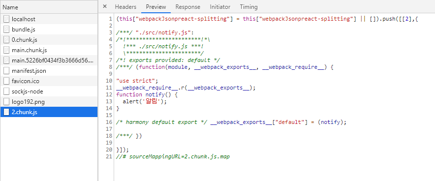
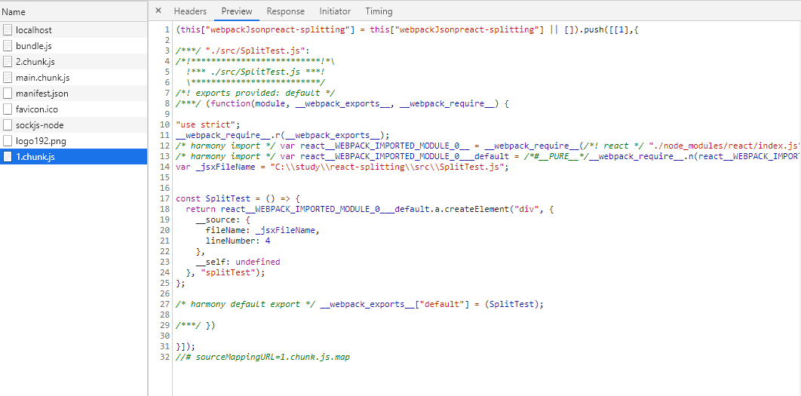

## 코드 스플리팅

- 코드 스플리팅이란

  - javascript로 앱을 개발하게 되면, 하나의 파일에 모든 로직들이 들어가게됩니다.
  하나의 파일에 집중 되다 보니 js파일의 용량도 늘어나고, 용량이 커지면 그만큼 페이지 로딩속도도 느려질 수 밖에 없습니다.

  - 코드 스플리팅을 하게 되면, 지금 당장 필요한 코드가 아니면 따로 분리시켜 필요할 경우에 불러와서 사용할 수 있습니다.
  그만큼 페이지 로딩 속도를 개선 할 수 있습니다.

- 코드 스플리팅 함수 준비

  - src/notify.js 추가

  ```javascript

    function notify(){
      alert('알림');
    }

    export default notify;

  ```

  - src/App.js 수정

  ```javascript

    import React, { Component } from 'react';

     class App extends Component {
       handleClick = () => {
         notify();
       };
       render() {
         return (
           <div>
             <button onClick={this.handleClick}>Click Me</button>
           </div>
         );
       }
     }

    export default App;

  ```  

  - 이렇게 설정하고 클릭 버튼을 누르면 notify함수의 알림창이 뜨게 됩니다.
  이제 이부분을 스플리팅 해보겠습니다.

  - src/App.js 수정

  ```javascript

    import React, { Component } from 'react';

    class App extends Component {
      handleClick = () => {
        // notify import를 함수로 호출하는것으로 변경
        // default로 notify를 호출하겠다고 선언
        import ('./notify').then(({ default:notify}) =>{ 
          
          notify();
        
        });
      };
      render() {
        return (
          <div>
            <button onClick={this.handleClick}>Click Me</button>
          </div>
        );
      }
    }

    export default App;

  ``` 

  - import를 함수로 사용하면 Promise를 반환합니다.
  import() 함수는 표준은 아니지만 webpack에서 지원해주는 함수 이기에 별도의 설정없이 바로 사용 할 수 있습니다.
  이함수는 모듈을 비동기적으로 불러오기 때문에 따로 default를 명시해 주어야 합니다.
  이렇게 하고 나서 Chrome 개발자 도구에 NetWork탭을 확인 하게 되면 chunk.js 파일을 호출하게 되고 그안에 notify관련 코드를 확인할 수 있습니다.
  이렇게 분리된 파일을 청크 파일이라고 합니다.
  import를 함수로 사용하게 되면, 웹팩이 코드를 분리하여 따로 저장하고, import가 호출될때 불러와서 사용 할 수 있게 해줍니다.

  


- 컴포넌트를 코드 스플리팅해보기 

  - src/SplitTest.js 추가

  ```javascript

  import React from 'react';

  const SplitTest =() =>{
    return <div>splitTest</div>;
  }

  export default SplitTest;
  ```

  - src/App.js 수정

  ```javascript

  import React, { Component } from 'react';

  class App extends Component {
    state ={
      SplitTest: null
    };
    handleClick = () => {
      import ('./SplitTest').then(({ default:SplitTest}) =>{ 
        this.setState({
          SplitTest
        });
      });
    };
    render() {
      return (
        <div>
          <button onClick={this.handleClick}>Click Me</button>
          {SplitTest && <SplitTest />}
        </div>
      );
    }
  }

  export default App;

  ```
  - http://localhost:3000/ 테스트

  

- Hoc ( Higher-order Component ) 을 통한 간편한 코드 스플리팅

  - 스플리팅 해야 하는 컴포넌트들이 너무 많다면 위 방법처럼 하나하나 state에 담기가 불편할 것입니다.
  Hoc을 사용하여 조금더 간편하게 처리하는 방법입니다.

  - src/sharedSplitting.js 추가

  ```javascript

    import React, { Component } from 'react';

    const sharedSplitting = getComponent => {
      // 여기서 getComponent 는 () => import('./SplitTest') 의 형태로 함수가 전달되야합니다.
      class sharedSplitting extends Component {
        state = {
          Splitted: null
        };

        constructor(props) {
          super(props);
          getComponent().then(({ default: Splitted }) => {
            this.setState({
              Splitted
            });
          });
        }

        render() {
          const { Splitted } = this.state;
          if (!Splitted) {
            return null;
          }
          return <Splitted {...this.props} />;
        }
      }

      return sharedSplitting;
    };

    export default sharedSplitting;

  ```

  - src/App.js 수정

  ```javascript

  import React, { Component } from 'react';
  import sharedSplitting from './sharedSplitting';

  // Hoc 을 사용하면 코드 스플리팅을 해야 하는 코드를 상단에 선언해주면 됩니다
  const SplitMe = sharedSplitting(() => import('./SplitTest'));

  class App extends Component {
    state = {
      visible: false
    };
    handleClick = () => {
      this.setState({
        visible: true
      });
    };
    render() {
      const { visible } = this.state;
      return (
        <div>
          <button onClick={this.handleClick}>Click Me</button>
          {visible && <SplitTest />}
        </div>
      );
    }
  }

  export default App;

  ```

- 라우터와 함께 사용하기

  - 기존 라우터 프로젝트를 사용 하도록 하겠습니다. ( react-route )

  - src/sharedSplitting.js 추가 ( Hoc에서 만들었던 컴포넌트와 동일 저는 복사 해서 넣었습니다.)

  ```javascript

  import React, { Component } from 'react';

    const sharedSplitting = getComponent => {

      class sharedSplitting extends Component {
        state = {
          Splitted: null
        };

        constructor(props) {
          super(props);
          getComponent().then(({ default: Splitted }) => {
            this.setState({
              Splitted
            });
          });
        }

        render() {
          const { Splitted } = this.state;
          if (!Splitted) {
            return null;
          }
          return <Splitted {...this.props} />;
        }
      }

      return sharedSplitting;
    };

    export default sharedSplitting;

  ```

  - src/pages/index.js 수정

  ```javascript

  // export { default as Home } from './Home';
  // export { default as Board } from './Board';

  // App.js에서 해도 되지만 좀더 깔끔하게 사용하기 위해서 index.js에서 수정하였습니다.
  import sharedSplitting from '../sharedSplitting';

  export const Home = sharedSplitting(() => import('./Home'));
  export const Board = sharedSplitting(() => import('./Board'));

  ```
  - http://localhost:3000/ 테스트

## 코드 스플리팅의 문제점..

  1. 서버에서는 리렌더링이 없음

    - 서버사이드에서는 리랜더링이 없습니다. 이 문제에 대한 해결책으로는 
    서버에서는 코드스플리팅을 적용하지 않는 방법이 있습니다.

  2. 페이지 깜박임

    - 페이지 깜박임 문제는 코드 스플리팅과 서버사이드 렌더링시의 작동 흐름 때문에 발생하게됩니다.
    이를 방지하기 위해선 사전에 필요 컴포넌트를 따로 정희해 놓고 도링이 끝난후 랜더링 함수를 호출하는 방법이 있습니다.