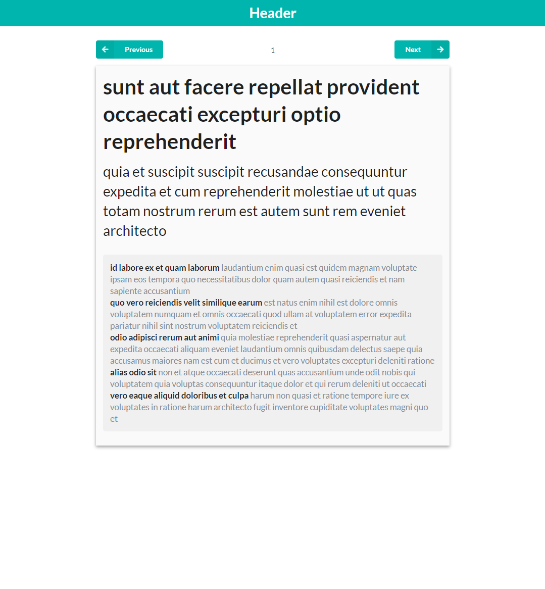

## React 비동기 처리

  - React에서 비동기 처리 방법중 axios를 사용하여 비동기 처리를 해보겠습니다.

    - axios의 장점

      + IE까지 대부분의 브라우저를 지원 ( 구형 브라우저 포함 )

      + Json 데이터를 자동 파싱 ( .json() 사용할 필요 X )

      + Node.js에서도 사용가능하다 

      + 요청을 중도 Cancel, 응답 시간 초과 설정 등의 기능이 있다.

      + 400, 500대의 Error 발생시에 reject로 response를 전달해 catch로 잡아 낼 수 있다.

    - axios 시작하기

      - 기존과 동일하게 create-react-app 으로 프로젝트를 생성

    - axios 설치
      ```javascript
      
      npm install --save axios
      
      // UI CSS 설치 CSS를 위해서..
      npm install --save semantic-ui-react semantic-ui-css

      ```
    - 프로젝트 구조

    ```
      react-axios
        -node_modules
        -public
        -src
          -components /* 컴포넌트 디렉토리 */
          -contatiners /* 컴포넌트들의 루트 컴포넌트 디렉토리 */
          -service /* axios api선언 디렉토리 */
          ...
          ...
          ...

    ```

      - 기존 구조에서 components, containers, service 디렉토리를 추가 하였습니다.
  
      - components와 contatiners에는 디렉토리를 관리하는 index.js를 추가해보았습니다. ( 컴포넌트들을 한곳에서 관리가 가능 )

      - 예제 코드에 css파일은 생략하겠습니다.

      - 테스트용 api https://jsonplaceholder.typicode.com 를 사용하여 테스트 하였습니다.

      - 컴포넌트 구조

      

    - src/index.js (css import)

    ```javascript

      import React from 'react';
      import ReactDOM from 'react-dom';
      import './index.css';
      import App from './App';
      // semantic css import 추가
      import 'semantic-ui-css/semantic.min.css';
      import * as serviceWorker from './serviceWorker';

      ReactDOM.render(<App />, document.getElementById('root'));

      // If you want your app to work offline and load faster, you can change
      // unregister() to register() below. Note this comes with some pitfalls.
      // Learn more about service workers: https://bit.ly/CRA-PWA
      serviceWorker.unregister();


    ```

    - src/service/api.js (axios api 선언)

    ```javascript

    import axios from 'axios';

    // 포스트 읽기
    export function getPost(postId) {
        return axios.get('https://jsonplaceholder.typicode.com/posts/' + postId);
    }

    // 결과값
    {
      "userId": 1,
      "id": 1,
      "title": "sunt aut facere repellat provident occaecati excepturi optio reprehenderit",
      "body": "quia et suscipit\nsuscipit recusandae consequuntur expedita et cum\nreprehenderit molestiae ut ut quas totam\nnostrum rerum est autem sunt rem eveniet architecto"
    }

    // 포스트의 댓글 읽기
    export function getComments(postId) {
        return axios.get(`https://jsonplaceholder.typicode.com/posts/${postId}/comments`)
    }

    // 결과 값
    [
      {
        "postId": 1,
        "id": 1,
        "name": "id labore ex et quam laborum",
        "email": "Eliseo@gardner.biz",
        "body": "laudantium enim quasi est quidem magnam voluptate ipsam eos\ntempora quo necessitatibus\ndolor quam autem quasi\nreiciendis et nam sapiente accusantium"
      },
      {
        "postId": 1,
        "id": 2,
        "name": "quo vero reiciendis velit similique earum",
        "email": "Jayne_Kuhic@sydney.com",
        "body": "est natus enim nihil est dolore omnis voluptatem numquam\net omnis occaecati quod ullam at\nvoluptatem error expedita pariatur\nnihil sint nostrum voluptatem reiciendis et"
      },
      {
        "postId": 1,
        "id": 3,
        "name": "odio adipisci rerum aut animi",
        "email": "Nikita@garfield.biz",
        "body": "quia molestiae reprehenderit quasi aspernatur\naut expedita occaecati aliquam eveniet laudantium\nomnis quibusdam delectus saepe quia accusamus maiores nam est\ncum et ducimus et vero voluptates excepturi deleniti ratione"
      },
      {
        "postId": 1,
        "id": 4,
        "name": "alias odio sit",
        "email": "Lew@alysha.tv",
        "body": "non et atque\noccaecati deserunt quas accusantium unde odit nobis qui voluptatem\nquia voluptas consequuntur itaque dolor\net qui rerum deleniti ut occaecati"
      },
      {
        "postId": 1,
        "id": 5,
        "name": "vero eaque aliquid doloribus et culpa",
        "email": "Hayden@althea.biz",
        "body": "harum non quasi et ratione\ntempore iure ex voluptates in ratione\nharum architecto fugit inventore cupiditate\nvoluptates magni quo et"
      }
    ]

    ```

    - src/components/Header.js (해더 컴포넌트와 해더 css파일 생성) 

    ```javascript

      import React from 'react';
      import './Header.css';

      const Header = () => (
          <div className="Header">
              Header
          </div>
      )

      export default Header;

    ```

    - src/components/PostWrapper/PostWrapper.js

    ```javascript

      import React from 'react';
      import './PostWrapper.css'

      // 여기서 인자로 children을 받습니다. this.props.children과 동일
      // 추후 생성할 components 폴더의 컴포넌트들을 인자로 받을 것입니다.
      const PostWrapper = ({children}) => {
          return (
              <div className="PostWrapper">
                  {children}
              </div>
          );
      };

      export default PostWrapper;

    ```

    - src/contatiners/PostContainer/PostContainer.js

    ```javascript

      import React, {Component} from 'react';
      import { PostWrapper, Navigator, Post, Warning } from '../../components';
      import * as service from '../../services/api';

      // 컴포넌트들을 관리할 루트 컴포넌트 입니다.
      class PostContainer extends Component {

          // state 값은 생성자에서만 선언합니다.
          constructor(props){
              super();

              this.state ={
                  postId: 1,
                  fetching: false,
                  post:{
                      title : null,
                      body : null
                  },
                  comments: [],
                  warningVisibility: false
              }
          }

          // 통신에러 일경우 경고창
          showWaring = () => {
              this.setState({
                  warningVisibility: true
              })

              setTimeout(
                  () => {
                      this.setState({
                          warningVisibility: false
                      });
                  }, 1500
              );
          }
          
          // api 통신 함수
          fetchPostInfo = async (postId) => {

              this.setState({
                  fetching: true
              })

              try {

                  const info = await Promise.all([
                  service.getPost(postId),
                  service.getComments(postId) 
                  ]);

                  console.log(info);

                  const {title, body} = info[0].data; 

                  const comments = info[1].data;

                  this.setState({
                      postId,
                      post: {
                          title,
                          body
                      },
                      comments,
                      fetching: false
                  });
              
              } catch (e) {
                  // 통신 에러 일경우 fetching -> false
                  // showWaring 경고창 함수 호출
                  this.setState({
                      fetching: false
                  });

                  this.showWaring();
                  
                  console.log('error occurred', e);
              }

          }

          // 리액트 라이프 사이클중 컴포넌트가 마운트 되었을때 호출 하는 함수
          // 마운트 되면 api호출하는 함수를 호출
          componentDidMount() {
              this.fetchPostInfo(1);
          }

          // Next 버튼과 Pre버튼 함수
          handleNavigateClick = (type) =>{
              const postId = this.state.postId;

              if(type === 'NEXT'){
                  this.fetchPostInfo(postId + 1);
              } else { 
                  this.fetchPostInfo(postId - 1);
              }
          }

          render() {
              const {postId, fetching, post, comments, warningVisibility} = this.state;

              return (
                  <PostWrapper>
                      <Navigator
                          postId={postId}
                          disabled={fetching}
                          onClick={this.handleNavigateClick}
                      />
                      <Post
                          title={post.title}
                          body={post.body}
                          comments={comments}
                      />
                      <Warning visible={warningVisibility} message="That post does not exist"/>
                  </PostWrapper>
              );
          }
      }

      export default PostContainer;

    ```

    - src/contatiners/index.js ( 루트컴포넌트를 한번에 관리하는 index.js )

    ```javascript
      import PostContainer from './PostContainer/PostContainer.js';

      export {
          PostContainer
      };
    ```

    - src/components/Navigator/Navigator.js ( Next, Pre 버튼 컴포넌트 생성 )

    ```javascript

      import React from 'react';
      // semantic css 버튼 css import
      import {Button} from 'semantic-ui-react';
      import './Navigator.css'

      // 인자로 onclick, 포스트아이디, 에러 발생시 버튼 비활성화 인자를 받습니다.
      const Navigator = ({onClick, postId, disabled}) => (
          <div className="Navigator">
              <Button
                  color="teal"
                  content="Previous"
                  icon="left arrow"
                  labelPosition="left"
                  onClick={
                      () => onClick('PREV')
                  }
                  disabled={disabled}
              />
              <div className="Navigator-page-num">
                  {postId}
              </div>
              <Button
                  color="teal"
                  content="Next"
                  icon="right arrow"
                  labelPosition="right"
                  className="Navigator-right-button"
                  onClick={
                      () => onClick('NEXT')
                  }
                  disabled={disabled}
              /> 
          </div>
      );

      export default Navigator;

    ```

    - src/components/Post/Post.js ( 포스트 내용과, 댓글을 담을 컴포넌트)

    ```javascript

      import React from 'react';
      import './Post.css';
      // 추후 작성할 댓글 리스트 컴포넌트
      import { CommentList } from '../';

      // 인자로 포스트 title, body, 댓글을 인자로 받아옵니다.
      const Post = ({title, body, comments}) => (
          <div className="Post">
              <h1>{title}</h1>
              <p>
                  {body}
              </p>
              <CommentList comments={comments}/>
          </div>
      );

      export default Post;


    ```

    - src/components/CommentList/CommentList.js

    ```javascript

      import React from 'react';
      // 추후 작성할 댓글 컴포넌트
      import {Comment} from '../';

      import './CommentList.css';

      // 인자로 댓글 컴포넌트를 받아 map함수로 뿌려주는 컴포넌트 입니다.
      const CommentList = ({comments}) => {

          const commentList = comments.map(
              (comment, index)=>(
                  <Comment 
                      name={comment.name}
                      body={comment.body} 
                      key={index}
                  />
              )
          );

          return (
              <ul className="CommentList">
                  {commentList}
              </ul>
          );
      };

      export default CommentList;

    ```

    - src/components/Comment/Comment.js

    ```javascript

        import React from 'react';
        import './Comment.css';

        // CommentList 컴포넌트에서 댓글의 name, body를 받아 댓글 컴포넌트를 생성
        const Comment = ({name, body}) => {
            return (
                <li className="Comment">
                    <p>
                        <b>{name}</b> {body}
                    </p>
                </li>
            );
        };

        export default Comment;

    ```

    - src/components/Warning/Warning.js ( 통신 실패시 경고창 컴포넌트)

    ```javascript

      import React, {Component} from 'react';
      import "./Warning.css";

      class Warning extends Component {

          // 생성시에 closing state 선언 
          constructor(props) {
              super(props);
              this.state = {
                  closing: false
              };
          }

          // 컴포넌트 생성후에 첫 렌더링을 마친 후 호출되는 메서드입니다.
          componentWillReceiveProps (nextProps) {

              if(this.props.visible && !nextProps.visible) {
              // visible props is changing from true -> false
                
                this.setState({
                    closing: true
                });

                // 1 sec after
                setTimeout(
                    () => {
                        this.setState({
                            closing: false
                        });
                    }, 1000
                );
              }
          }
          

          render() {
              const { visible, message } = this.props;
              const { closing } = this.state;

              if(!visible && !closing) return null;
              return (
                  <div className="Warning-wrapper">
                      <div className={`Warning ${closing?'bounceOut':'bounceIn'} animated`}>
                          {message}
                      </div>
                  </div>
              );
          }
      }

      export default Warning;

    ```

    - src/components/index.js ( 컴포넌트들을 한번에 관리 하는 index.js)

    ```javascript

      import Header from './Header/Header';
      import PostWrapper from './PostWrapper/PostWrapper';
      import Navigator from './Navigator/Navigator';
      import Post from './Post/Post';
      import Comment from './Comment/Comment';
      import CommentList from './CommentList/CommentList';
      import Warning from './Warning/Warning';

      export {
          Header,
          PostWrapper,
          Navigator,
          Post,
          CommentList,
          Comment,
          Warning
      };

    ```

    - src/App.js ( 생성한 컴포넌트들을 App.js컴포넌트에서 호출 )

    ```javascript

      import React, { Component } from 'react';
      import {PostContainer} from './containers';
      import { Header } from './components';

      class App extends Component {
        render() {
          return (
              <div>
                  <Header/>
                  <PostContainer/>
              </div>    
          );
        }
      }

      export default App;

    ```

    - 테스트 http://localhost:3000/

    

