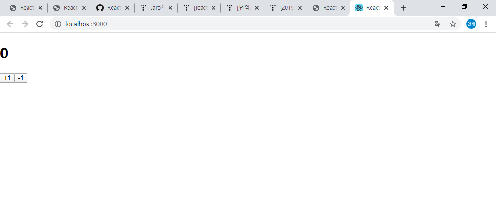

## React 상태관리

  - Mobx란

    - React에서 사용하는 상태 관리 라이브러리중 Redux와 함께 많이 사용 되고 있는 상태관리 라이브러리 입니다.

  - Mobx의 장점

    - 객체 지향적입니다.

    + ECS6에 추가 된 Class를 이름뿐인 Class가 아니라 객체 지향적으로 사용 하고 개발하는 것을 권장 하고 있습니다.

    + Spring FrameWork와 유사한 아키텍쳐 구조를 지향 하고 있어서 조금더 친숙하게 접근할 수 있습니다.

    - 데코레이터 사용가능

    + 데코레이터 (Java의 어노테이션과 유사하다고 생각하시면 됩니다.)
    Redux를 사용 할 때 component와 state를 연결 하기위한 mapStateToProps, Redux action을 연결하기 위한 mapDispatchToProps.... 등등의 
    코드가 사라지고 데코레이터로 처리하기 때문에 깔끔한코드 작성이 가능합니다.

    - 여러개의 Store 작성 가능

    + Redux에서는 단 하나의 스토어에서 모든컬 처리하지만 Mobx에선 여러개의 스토어를 작성할 수 있습니다. ( 장점이자 단점이 될 수 도 있다고 생각합니다. )


  - Mobx의 주요 개념

    + Observable State (관찰을 받고 있는 state)

    Mobx에서 Rendering 대상이 되는 state 값을 관찰대상 (observable value)라고 하며 
    @observable 데코레이터로 지정한 state는 관찰 대상으로 지정되고 state 값이 변공 될 때 마다 리랜더링 됩니다.

    + Action( 액션 )

    상태에서 어떻게 변화를 일으킬 것인지 정의 하는 부분. 

    + Computed ( 연산된 값 )

    이벤트 발생으로 인해 어떠한 연산에 필요로 하는 state에 변화가 생겼을때, 그 state변화에 따라서 새로운 연산 작업을 수행하게 된다.
    state에 변화가 없으면, 그냥 기존의 값을 사용한다.

  - Mobx 시작하기

  ```
    npm create-react-app <프로젝트명>
    npm i mobx mobx-react

    // 데코레이터를 사용하기 위함입니다.
    npm i @babel/plugin-proposal-class-properties @babel/plugin-proposal-decorators

    // eject를 풀어 줘야 합니다. y 선택
    npm run eject

    // 에러가 난다면 
    error -> git init -> commit 까지..

  ```

  - 프로젝트 구조

    - 기본적으로 create-react-app 의 구조를 그대로 사용하였습니다.

    - src/components
      디렉토리 생성

    - src/store/counter.js (예제 store 생성)

    ```javascript

      import { observable, action } from "mobx";

      export default class CounterStore{
          // observable state 선언
          @observable number = 0;
        
          // number state를 ++ 하는 action 생성
          @action increase = () => {
              this.number++;
          }

          // number state를 -- 하는 action 생성
          @action decrease = () => {
              this.number--;
          }
      }

    ```

    - src/components/Counter.js ( 예제 counter컴포넌트 생성 )

    ```javascript

    import React, { Component } from 'react';
    import { observer, inject } from 'mobx-react';

    // store를 injection 하는 데코레이터
    // inject(스토어명) 으로도 injection 할 수 있고
    // inject(stores =>({ number: stores.counter.number, ..... })) 로 원하는 부분만 가져올 수 도 있습니다.
    @inject('counter')
    // 컴포넌트를 obeserver( 관찰 )하겠다는 데코레이터
    @observer
    class Counter extends Component {
      render() {
        // injection된 counter 스토어를 props 선언
        const { counter } = this.props;
        return (
          <div>
            // 스토어의 number state
            <h1>{counter.number}</h1>
            // onclick시 스토어의 increase action 호출
            <button onClick={counter.increase}>+1</button>
            // onclick시 스토어의 decrease action 호출
            <button onClick={counter.decrease}>-1</button>
          </div>
        )
      }
    }

    export default Counter;

    ```

    - src/App.js

    ```javascript

    import React, { Component } from 'react'
    import Counter from './components/Counter'

    export default class App extends Component {
      render() {
        return (
          <div>
            // Counter 컴포넌트 선언
            <Counter/>
          </div>
        )
      }
    }


    ```

    - src/index.js

    ```javascript

    import React from 'react';
    import ReactDOM from 'react-dom';
    import './index.css';
    import App from './App';
    import * as serviceWorker from './serviceWorker';
    import { Provider } from 'mobx-react';
    import CounterStore from './stores/counter';

    // 작성한 스토어 객체 선언
    const counter = new CounterStore(); 

    ReactDOM.render(
        // Provider에 스토어 추가
        <Provider counter={counter}>
        <App />
        </Provider>, 
        document.getElementById('root')
    );

    serviceWorker.unregister();


    ```

    - 간단하게 +, - 기능을 mobx를 이용해서 만들어 보았습니다. 

    - 'http://localhost:3000/ 테스트

    