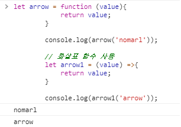
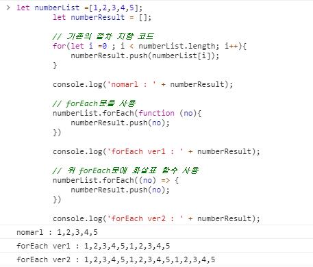
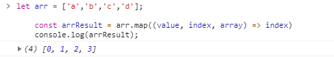
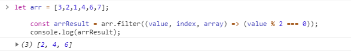
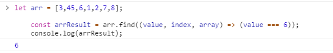
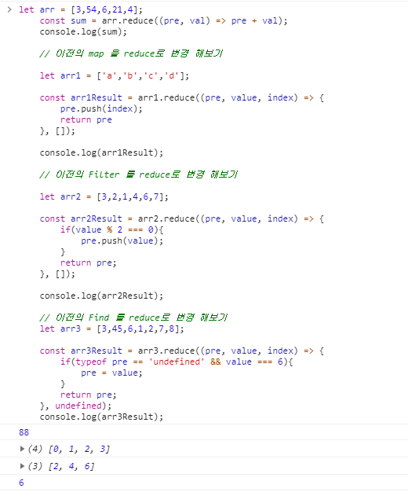
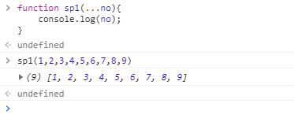

# 기본적인 함수형 프로그래밍

- 제가 생각 하는 자바스크립트에서의 함수형 프로그래밍은
자바 스크립트를 좀더 객체 지향적으로 사용하기 위함이라고 생각합니다.
완전히 객체 지향적이기에는 부족할 수 있지만 절차지향 프로그래밍 보다는
더 경제성 있는 코드를 작성 할 수 있다고 생각하였습니다.

    - 예제코드 ( 절차 지향형 )

    ```javascript

    const arr =[
        'a',
        'b',
        'c',
        'd',
        'e'
    ];

    const result =[];

    for(let i =0; i < arr.length; i++){
        let arrChar = arr[i];
        arrChar = arrChar.toUpperCase();
        result.push(arrChar);
    }

    result.reverse();

    console.log(result);

    ```
    - 위 코드는 보시면 기존의 방법대로 

    1. 소문자 -> 대문자로 변경
    2. 배열 반대로 정렬

    을 하는 코드입니다.
    이걸 함수형으로 작성해보면

    - 예제코드 ( 함수형 )

    ```javascript

    const arr =[
        'a',
        'b',
        'c',
        'd',
        'e'
    ];

    // 굳이 만들 필요는 없지만.. 
    // 설명을 위해 대문자 변환 함수를 작성하였습니다.
    const charUpperCase = (char) => {
        return char.toUpperCase();
    }

    const result = arr
    .map(value => charUpperCase(value))
    .reverse();

    console.log(result);

    ```

    - 이렇게 간단하게 변경 할 수 있습니다.
    위 예제 에서는 자바스크립트에 내장 되어있는 toUpperCase 함수를 그냥 사용 해도되지만 설명을 위해 추가하였습니다.
    이렇게 함수형으로 코드를 작성한다면 코드의 재사용성이나 가독성등이 좋아진다고 생각합니다.
    

- ECS6 기본 함수

    - 화살표 함수 

        - 화살표 함수 표기법

        ```javascript

        // 매개변수 지정 방법
            () => { ... } // 매개변수가 없을 경우
            x => { ... } // 매개변수가 한 개인 경우, 소괄호를 생략할 수 있다.
        (x, y) => { ... } // 매개변수가 여러 개인 경우, 소괄호를 생략할 수 없다.

        // 함수 몸체 지정 방법
        x => { return x * x }  // single line block
        x => x * x             // 함수 몸체가 한줄의 구문이라면 중괄호를 생략할 수 있으며 암묵적으로 return된다. 위 표현과 동일하다.

        () => { return { a: 1 }; }
        () => ({ a: 1 })  // 위 표현과 동일하다. 객체 반환시 소괄호를 사용한다.

        () => {           // multi line block.
        const x = 10;
        return x * x;
        };

        ```

        - 화살표 함수 예제

        ```javascript

        // 화살표 함수를 사용하지 않았을때
        let arrow = function (value){
            return value;
        }

        console.log(arrow('nomarl'));

        // 화살표 함수 사용
        let arrow1 = (value) =>{
            return value;
        }

        console.log(arrow1('arrow'));

        ```
        - 결과

        

        - 화살표 함수는 위 예제코드와 같이 익명 함수에서만 사용이 가능 합니다.
            
            - 화살표 함수의 특징

            1. 화살표 함수를 사용 했을때 사용하지 않았을때 보단 조금더 간결하게 작성할 수 있습니다.
            2. function 키워드를 사용 했을때와 다른 this의 차이점 ( 정리 페이지 참조)
            3. 화살표 함수의 자세한 정리 https://poiemaweb.com/es6-arrow-function

    - 기본적인 Loop 예제

    ```javascript

        let numberList =[1,2,3,4,5];
        let numberResult = [];

        // 기존의 절차 지향 코드
        for(let i =0 ; i < numberList.length; i++){
            numberResult.push(numberList[i]);
        }

        console.log('nomarl : ' + numberResult);

        // forEach문을 사용
        numberList.forEach(function (no){
            numberResult.push(no);
        })

        console.log('forEach ver1 : ' + numberResult);

        // 위 forEach문에 화살표 함수 사용
        numberList.forEach((no) => {
            numberResult.push(no);
        })

        console.log('forEach ver2 : ' + numberResult);

    ```
    - 결과

    

    - Map 함수 예제

    ```javascript

    // map 함수 ( 리액트에서 리스트 표기할때 많이사용 )
    // 인자값으로 value, index, array 를 가집니다.
    let arr = ['a','b','c','d'];

    const arrResult = arr.map((value, index, array) => index)
    console.log(arrResult);

    ```

    - 결과

    

    - Filter 함수 예제

    ```javascript

    // Filter 함수
    // 요소를 걸러내어 배열로 true/false 반환
    let arr = [3,2,1,4,6,7];

    const arrResult = arr.filter((value, index, array) => (value % 2 === 0));
    console.log(arrResult);

    ```

    - 결과

    

    - Find 함수 예제

    ```javascript

    // Find 함수
    // find뜻 그대로 찾는 함수 입니다. (동일한 값이 있을 경우 첫번째만 리턴)
    let arr = [3,45,6,1,2,7,8];

    const arrResult = arr.find((value, index, array) => (value === 6));
    console.log(arrResult);


    ```

    - 결과

    

    - Reduce 함수 예제

    ```javascript

    // Reduce함수
    // 인자값으로 preValue (누적값), value, index, array 를 가집니다.

    let arr = [3,54,6,21,4];
    const sum = arr.reduce((pre, val) => pre + val);
    console.log(sum);

    // 이전의 map 을 reduce로 변경 해보기

    let arr1 = ['a','b','c','d'];

    const arr1Result = arr1.reduce((pre, value, index) => {
        pre.push(index);
        return pre
    }, []);

    console.log(arr1Result);

    // 이전의 Filter 를 reduce로 변경 해보기

    let arr2 = [3,2,1,4,6,7];

    const arr2Result = arr2.reduce((pre, value, index) => {
        if(value % 2 === 0){
            pre.push(value);
        }
        return pre;
    }, []);

    console.log(arr2Result);

    // 이전의 Find 를 reduce로 변경 해보기
    let arr3 = [3,45,6,1,2,7,8];

    const arr3Result = arr3.reduce((pre, value, index) => {
        if(typeof pre == 'undefined' && value === 6){
            pre = value;
        }
        return pre;
    }, undefined);
    console.log(arr3Result);

    ```

    - 결과

    

- 비구조화 할당 문법..(Ex.[...value])

    - 예제

    ```javascript

    // 배열 [] 혹은 객체 {}값을 편하게 꺼내 쓸 수 있는 문법입니다.
    function sp1(...no){
        console.log(no);
    }

    sp1(1,2,3,4,5,6,7,8,9);

    ```

    - 결과

    

- member import ( import 표현식)

    - 코드를 보시다 보면 익숙하지 않은 import 방식을 볼 수 있습니다.

    ```javascript

        // 기본적인 import 방법
        import PostContainer from './containers';

        // 이렇게 PostContainer가 {}로 랩핑 되어있는 걸 볼수 있습니다.
        // 이런 표현식을 member import라고 부르는데
        // 여러 값을 import할 때 사용합니다. Ex.) import { PostContainer, warrping, post } from './containers';
        import { PostContainer } from './containers';

    ```